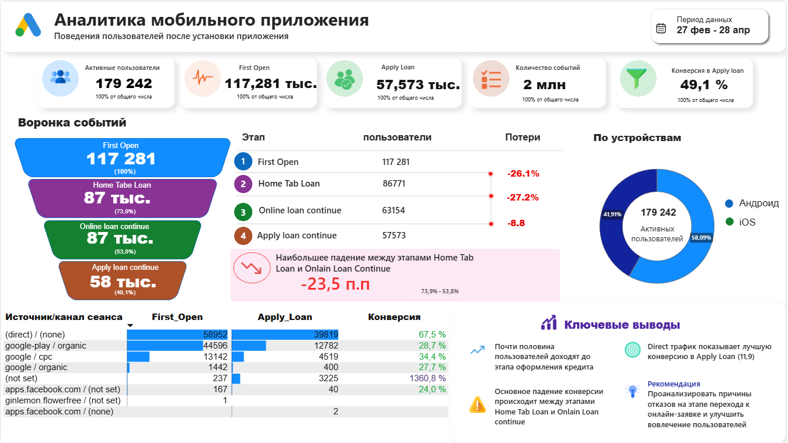

# Loan Funnel Analysis

Power BI analysis of user behavior in a mobile app, from the first app open to a completed loan application.

## About the project

The goal of the analysis was to understand how users move through the loan funnel and where the largest drop-offs occur.

The funnel consists of four main stages:

- First Open
- Home Tab Loan
- Online Loan Continue
- Apply Loan Continue

The analysis also looks at traffic sources and user distribution by operating system.

## Key findings

- 117,281 users opened the app for the first time.
- 86,771 users reached the Home Tab Loan stage.
- 63,154 users continued the online loan process.
- 57,573 users reached the Apply Loan Continue stage.
- The largest drop-off occurred between Home Tab Loan and Online Loan Continue: **-23.5 percentage points**.
- Overall conversion from First Open to Apply Loan Continue was **49.1%**.

Direct traffic showed the highest conversion among the main traffic sources.

## Dashboard

The dashboard includes:

- loan funnel analysis;
- conversion between funnel stages;
- drop-off analysis;
- traffic source performance;
- operating system distribution;
- key findings and recommendations.

## Data

The project uses event-level mobile app data with information about:

- user events;
- traffic sources;
- operating systems.

## Tools

- Power BI
- DAX
- Data visualization
- Funnel analysis

## Files

- `Loan Funnel Analysis.pbix` — Power BI report
- `dashboard.png` — dashboard preview
- `data.csv` — main dataset
- `event_source_data.csv` — event/source data
- `operating_system_data.csv` — operating system data
